# 🔧 Correção: Associação Lead → Cliente KYC

## 📋 Problema Identificado

O sistema estava gerando links de registro para leads, mas **não estava associando o cliente criado ao lead original**. Isso causava:

1. ❌ Leads sem rastreamento de conversão
2. ❌ Dashboard do cliente não mostrava origem
3. ❌ Impossível saber qual lead se tornou qual cliente
4. ❌ Funil de conversão incompleto

## ✅ Solução Implementada

### 1. **Banco de Dados** (EXECUTAR PRIMEIRO!)

**Arquivo:** `add_lead_id_to_kyc_clientes.sql`

Execute este script SQL para adicionar as colunas necessárias:

```sql
-- Adiciona coluna lead_id
ALTER TABLE kyc_clientes 
ADD COLUMN IF NOT EXISTS lead_id INT NULL;

-- Adiciona coluna origem
ALTER TABLE kyc_clientes 
ADD COLUMN IF NOT EXISTS origem VARCHAR(50) NULL DEFAULT 'registro_direto';

-- Cria índices e constraints
ALTER TABLE kyc_clientes ADD INDEX idx_lead_id (lead_id);
ALTER TABLE kyc_clientes ADD CONSTRAINT fk_kyc_clientes_lead 
FOREIGN KEY (lead_id) REFERENCES leads(id) ON DELETE SET NULL;
```

**Como executar:**
```bash
# Via terminal MySQL
mysql -u seu_usuario -p seu_banco < add_lead_id_to_kyc_clientes.sql

# Ou copie e cole no phpMyAdmin / Adminer
```

### 2. **Backend - Arquivos Modificados**

#### `ajax_send_kyc_to_lead.php` (Linha 74-76)
**Antes:**
```php
$kyc_url = $base_url . "/cliente_registro.php?cliente=" . urlencode($lead['empresa_slug']);
```

**Depois:**
```php
$kyc_url = $base_url . "/cliente_registro.php?cliente=" . urlencode($lead['empresa_slug']) 
          . "&lead_id=" . $lead_id;
```

✅ **Resultado:** URL agora inclui `&lead_id=123` para rastreamento

---

#### `cliente_registro.php` (Linhas 170-228)
**Antes:**
```php
// Inseria cliente sem lead_id
INSERT INTO kyc_clientes (...) VALUES (...)
```

**Depois:**
```php
// Captura lead_id da URL
$lead_id_contexto = $_GET['lead_id'] ?? null;

// Insere com lead_id e origem='lead_conversion'
INSERT INTO kyc_clientes (..., lead_id, origem) VALUES (..., ?, 'lead_conversion')

// Atualiza status do lead após registro
UPDATE leads SET status = 'qualificado' WHERE id = ?

// Registra no histórico
INSERT INTO leads_historico (lead_id, acao, descricao) 
VALUES (?, 'registro_completado', 'Lead completou o registro')
```

✅ **Resultado:** 
- Cliente associado ao lead
- Lead marcado como "qualificado"
- Histórico completo registrado
- Código compatível com bancos sem migração (fallback automático)

---

#### `cliente_dashboard.php` (Linhas 25-45, 227-237)
**Antes:**
```php
// Buscava apenas status do KYC
SELECT status FROM kyc_empresas WHERE cliente_id = ?
```

**Depois:**
```php
// Busca cliente + lead de origem
SELECT kc.*, l.nome as lead_nome, l.data_criacao as lead_data_criacao
FROM kyc_clientes kc
LEFT JOIN leads l ON kc.lead_id = l.id
WHERE kc.id = ?

// Exibe alerta informativo se veio de lead
if ($lead_origem): ?>
    <div class="alert alert-info">
        Bem-vindo! Seu cadastro foi iniciado a partir de um lead 
        registrado em <?= date('d/m/Y', ...) ?>.
        ID do Lead: #<?= $lead_origem['id'] ?>
    </div>
<?php endif; ?>
```

✅ **Resultado:** Cliente vê de onde veio seu cadastro (transparência)

---

## 🎯 Fluxo Completo Corrigido

```mermaid
graph LR
    A[Lead criado] --> B[Admin clica 'Enviar Cadastro']
    B --> C[Sistema gera URL com lead_id]
    C --> D[Lead recebe link por Email/WhatsApp]
    D --> E[Lead preenche cliente_registro.php]
    E --> F[Sistema cria kyc_clientes com lead_id]
    F --> G[Lead status → 'qualificado']
    G --> H[Histórico registrado]
    H --> I[Cliente vê origem no dashboard]
```



## 📊 Dados Rastreados

| Campo | Descrição | Exemplo |
|-------|-----------|---------|
| `lead_id` | ID do lead original | `42` |
| `origem` | Como o cliente chegou | `lead_conversion` |
| `status` (lead) | Atualizado para | `qualificado` |
| `lead_data_criacao` | Data inicial do lead | `2025-10-15` |

## 🔍 Como Verificar se Funcionou

### 1. Verificar estrutura do banco:
```sql
SHOW COLUMNS FROM kyc_clientes LIKE '%lead%';
-- Deve retornar: lead_id (int, NULL)

SELECT * FROM kyc_clientes WHERE lead_id IS NOT NULL;
-- Mostra clientes que vieram de leads
```

### 2. Testar o fluxo:
1. Acesse `leads.php`
2. Clique em "Enviar Formulário de Cadastro"
3. Escolha método (Email/WhatsApp/Link)
4. Copie a URL gerada - deve conter `&lead_id=X`
5. Abra a URL em navegador anônimo
6. Complete o registro
7. Verifique:
   - Dashboard do cliente mostra alerta de origem ✅
   - Lead status mudou para "qualificado" ✅
   - Histórico do lead tem entrada "registro_completado" ✅

### 3. Verificar no banco:
```sql
-- Cliente criado a partir de lead #10
SELECT * FROM kyc_clientes WHERE lead_id = 10;

-- Lead com conversão bem-sucedida
SELECT l.*, kc.nome_completo as cliente_nome
FROM leads l
LEFT JOIN kyc_clientes kc ON kc.lead_id = l.id
WHERE l.status = 'qualificado';
```

## 🛡️ Compatibilidade Retroativa

O código foi feito com **fallback automático**:

- ✅ Se `lead_id` existir → usa integração completa
- ✅ Se `lead_id` não existir → funciona sem erro (modo legado)
- ✅ Logs informativos em `error.log` indicam quando migração é necessária

**Mensagens no error.log:**
```
INFO: Coluna lead_id não existe em kyc_clientes. 
      Execute add_lead_id_to_kyc_clientes.sql
```

## 📈 Benefícios

1. **Rastreamento Completo:** Cada cliente sabe de qual lead veio
2. **Funil Preciso:** Dashboard mostra conversão real Lead → Cliente
3. **Transparência:** Cliente vê origem do seu cadastro
4. **Histórico:** Auditoria completa de conversões
5. **Relatórios:** Pode medir taxa de conversão por campanha/origem

## 🚀 Próximos Passos

Após executar a migração SQL, o sistema estará **100% funcional** com:

- ✅ Associação automática Lead → Cliente
- ✅ Dashboard do cliente mostrando origem
- ✅ Funil de conversão completo
- ✅ Histórico de todas as conversões
- ✅ Status do lead atualizado automaticamente

---

**Data:** 2025-11-02  
**Versão:** 1.0  
**Status:** ✅ Pronto para produção (execute a migração SQL primeiro)
